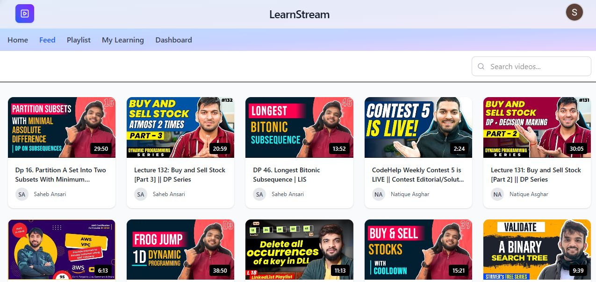

# LearnStream

[🌐 Live Demo](https://learnstream.netlify.app) | [🐞 Report Bug](https://github.com/Saheb142003/LearnStream/issues) | [✨ Request Feature](https://github.com/Saheb142003/LearnStream/issues)

---


**LearnStream** is an **AI-powered educational platform** that transforms passive video watching into an interactive learning experience. Paste any YouTube URL and get an instant transcript, AI-generated summary, and auto-graded quiz — no distractions, no ads.

- **Tech Stack:** React 19, Tailwind CSS, Node.js, Express, MongoDB, Google Gemini AI
- **Live Site:** [https://learnstream.netlify.app](https://learnstream.netlify.app)

---

## 📸 Screenshots

|                **Home Page**                |                  **Feed**                  |
| :-----------------------------------------: | :----------------------------------------: |
|       |           |
| _Transform videos into knowledge instantly_ | _Discover and track your learning journey_ |

---

In the age of endless content, **retention** is the real challenge. Students and professionals watch hours of tutorials but often struggle to recall key concepts or test their understanding.

**LearnStream solves this by:**

1. **Removing Distractions**: No sidebar recommendations or ads.
2. **Active Recall**: AI-generated quizzes force you to test your knowledge immediately.
3. **Quick Review**: Summaries and transcripts allow for rapid revision without re-watching.

If you support this mission, leaving a ⭐ helps others discover the project!

---

## 🚀 Key Features

| Feature                 | Description                                             |
| ----------------------- | ------------------------------------------------------- |
| **AI Transcripts**      | Fetched via `youtube_transcript_api` — works reliably   |
| **Smart Summaries**     | AI-generated summaries with full markdown rendering     |
| **Interactive Quizzes** | Auto-generated 5-question quizzes to test retention     |
| **Distraction Free**    | Clean player interface focused on learning              |
| **Progress Tracking**   | Track watched videos, quiz scores, and learning streaks |
| **Playlist Support**    | Import entire YouTube playlists                         |
| **Secure Auth**         | Google OAuth & Local Authentication                     |
| **Responsive Design**   | Works seamlessly on desktop and mobile                  |
| **Rate Limited API**    | Per-IP & per-user limits protect backend from abuse     |

---

## 🧪 Tech & Architecture

This project is a **Monorepo** with a React frontend and an Express backend.

### **Frontend**

- **Framework:** React 19 (Vite)
- **Styling:** Tailwind CSS v4, Framer Motion
- **Icons:** Lucide React
- **State/Routing:** React Router v7, Context API
- **SEO:** React Helmet Async

### **Backend**

- **Runtime:** Node.js
- **Framework:** Express.js
- **Database:** MongoDB (Mongoose)
- **AI Engine:** Google Gemini API (multi-model cascade with fallback)
- **Authentication:** Passport.js (Google OAuth)
- **Transcript Engine:** `youtube_transcript_api` (Python ≥1.2.4) + Invidious fallback
- **Concurrency:** In-memory semaphore, request queue, in-flight deduplication, LRU cache

## 🛠️ Getting Started

Follow these steps to run LearnStream locally.

### Prerequisites

- Node.js (v18+)
- Python 3.9+ with `youtube_transcript_api` installed
- MongoDB (Local or Atlas URI)
- Google Gemini API Key
- Google OAuth credentials

### Installation

1. **Clone the repository**

   ```bash
   git clone https://github.com/Saheb142003/LearnStream.git
   cd LearnStream
   ```

2. **Install Python dependency** (required for transcript fetching)

   ```bash
   pip install youtube-transcript-api
   ```

3. **Install Node dependencies**

   ```bash
   # Frontend
   cd frontend && npm install

   # Backend
   cd ../server && npm install
   ```

4. **Environment Setup** — create `server/.env`:

   ```env
   PORT=5000
   CLIENT_URL=http://localhost:5173
   MONGO_URI=your_mongodb_connection_string

   GOOGLE_CLIENT_ID=your_google_client_id
   GOOGLE_CLIENT_SECRET=your_google_client_secret
   SESSION_SECRET=your_session_secret

   GEMINI_API_KEY_SUMMARY=your_gemini_api_key
   GEMINI_API_KEY_QUIZ=your_gemini_api_key
   YOUTUBE_API_KEY=your_youtube_data_api_key

   # Optional tuning (safe defaults apply without these)
   TRANSCRIPT_CONCURRENCY=3
   TRANSCRIPT_QUEUE_DEPTH=20
   TRANSCRIPT_TIMEOUT_MS=30000
   ```

5. **Run the application** — open two terminals:

   ```bash
   # Terminal 1 — Backend
   cd server && npm start

   # Terminal 2 — Frontend
   cd frontend && npm start
   ```

6. Open [http://localhost:5173](http://localhost:5173) in your browser.

---

## 📝 License

LearnStream is licensed under the **MIT License** — free to use for personal and educational purposes. See `LICENSE` for details.

---

## 👥 Contributors

- **Lead Developer:** Md Sahebuddin Ansari ([@Saheb142003](https://github.com/Saheb142003)) — Full Stack Developer

Contributions are welcome! Feel free to open an issue or submit a pull request.

---

## 📬 Contact

- **Website:** [https://learnstream.netlify.app](https://learnstream.netlify.app)
- **GitHub:** [https://github.com/Saheb142003](https://github.com/Saheb142003)
- **LinkedIn:** [https://www.linkedin.com/in/saheb142003](https://www.linkedin.com/in/saheb142003)
- **Email:** <saheb142003@gmail.com>
